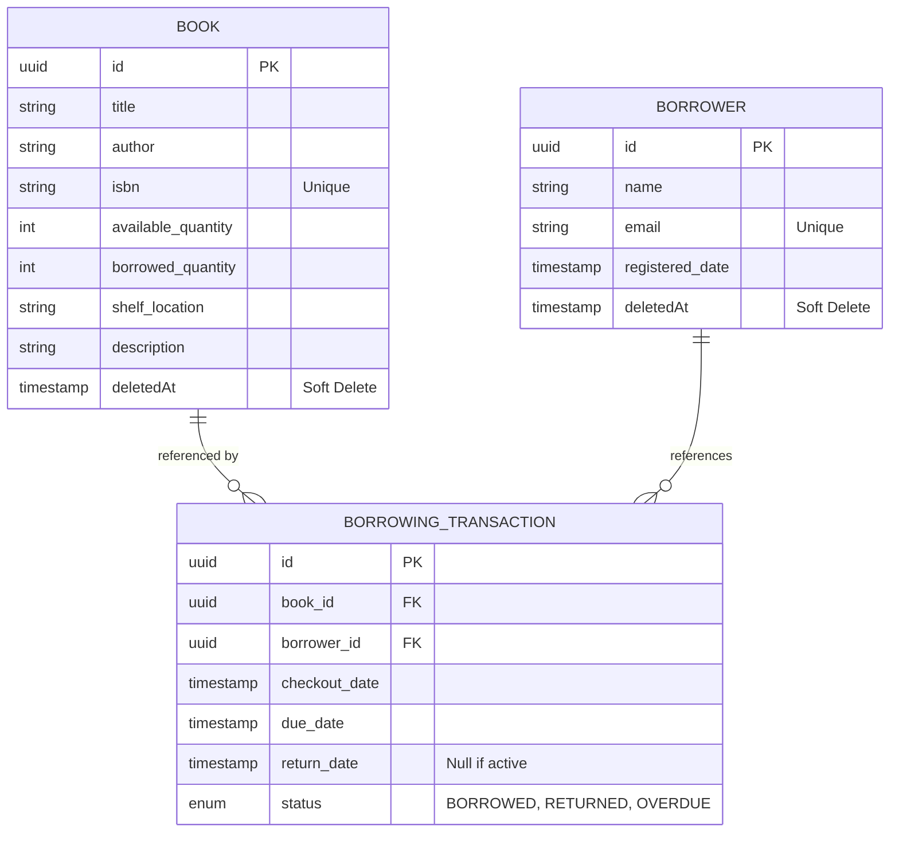

# Library Management System

A robust, enterprise-grade Library Management System built with **NestJS**, **Sequelize (PostgreSQL)**, and **Docker**. This system provides a comprehensive API for managing book inventory, borrower profiles, and the complete borrowing lifecycle.

---

## 🚀 Getting Started

### 1. Prerequisites
- **Docker Desktop** (Engine running)
- **Node.js 20+** (if running locally)
- **PostgreSQL 15** (if running locally)

### 2. Environment Configuration
Create a `.env` file in the `library-management-system/` directory (or use the one provided):

```env
# Database Configuration
DB_HOST=db
DB_PORT=5432
DB_USER=postgres
DB_PASSWORD=1q2w3e4r5t
DB_DATABASE=library_system
DB_SCHEMA=public

# Node Environment
NODE_ENV=development
PORT=3001

# Auth Configuration
BASIC_USER=eyad@gmail.com
BASIC_PASS=1q2w3e4r5t
```

---

## 🐳 Docker Deployment (Recommended)

The project is fully containerized with automated workflow orchestration.

1. **Navigate to the project folder:**
   ```bash
   cd library-management-system
   ```

2. **Start the system:**
   ```bash
   docker-compose up --build -d
   ```

**What happens automatically:**
*   Starts a PostgreSQL 15 container.
*   **Health Check**: The app container waits until the database is fully responsive (`pg_ready`) before proceeding.
*   **Database Migrations**: Automatically runs all migrations to create the refined schema.
*   **Idempotent Seeders**: Automatically populates the database with books, borrowers, and transaction history (skipping records if already present).
*   API becomes live at: [http://localhost:3001](http://localhost:3001)

---

## 🛠️ Comprehensive Feature List

### 1. **Modular Architecture & Framework**
- **NestJS**: Built using a modular, service-oriented architecture for clarity and scalability.
- **Dependency Injection**: Decoupled components for easier unit testing and maintainability.

### 2. **Professional Database Management**
- **Sequelize ORM**: Strongly typed database interactions.
- **Migrations**: Database schema versioning for consistent development and production environments.
- **Idempotent Seeders**: Custom-built seeders that check for `ISBN` (Books) and `Email` (Borrowers) before inserting, making re-runs safe.
- **Soft Deletion**: Preserves historical data for books and borrowers while hiding them from active API results.

### 3. **Security & Authentication**
- **Basic Authentication**: Implemented across all administrative endpoints to ensure data security.
- **Public vs Protected access**: Uses a custom `@Public()` decorator to allow open access to the books catalog while keeping management endpoints secure.
- **Rate Limiting**: Integrated `@nestjs/throttler` to prevent brute-force attacks and API scraping (especially on `create` and `list` endpoints).

### 4. **Automated Background Tasks (Cron)**
- **Scheduled Status Updates**: A background cron job runs daily at 1 AM to scan all active borrows. It automatically updates statuses to `OVERDUE` if they have passed their `due_date`.

### 5. **Robust Validation & Type Safety**
- **Strict DTOs**: Implemented data transfer objects for all inputs.
- **Class-Validator & Transformer**: All API payloads are strictly validated for types, formats (like Email), and constraints (like ISBN uniqueness).

### 6. **Analytical Reporting & Data Export**
- **Advanced SQL Analytics**: Custom aggregations to provide "Top 5 Books" and transactional summaries by status and period.
- **Excel/CSV Export**: Backend generation of multi-formatted files (`.csv` and `.xlsx`) using `json2csv` and `exceljs`.
- **Streamlined API**: Specialized endpoints for "Last Month" activity for easy administrative reporting.

### 7. **Quality Assurance (Unit Testing)**
- **100% Core Business Logic Coverage**: A comprehensive test suite with **40 individual tests** ensuring both success and error paths for:
  - Book availability and stock management.
  - Borrower registration and uniqueness.
  - Borrowing transactions, returns, and overdue calculations.
- **To run all tests**: `npm run test` (from root or library folder).

### 8. **API Documentation (Swagger)**
- **Interactive Documentation**: Full OpenAPI/Swagger integration with detailed endpoint descriptions and examples.
- **Enum-Based Selection**: Swagger provides dropdown menus for selecting export formats (`csv` vs `xlsx`).

---

## 📖 Key API Endpoints Reference

### **Books Management** (`/books`)
- `POST /books`: Add new book (Secure + Rate Limited).
- `GET /books`: List books with search/filters (Public + Rate Limited).
- `GET /books/:id`: Get detailed book info.
- `PATCH /books/:id`: Update book details.
- `DELETE /books/:id`: Soft-delete a book.

### **Borrowers Management** (`/borrowers`)
- `POST /borrowers`: Register new borrower.
- `GET /borrowers`: List all registered borrowers.
- `PATCH /borrowers/:id`: Update personal details.

### **Borrowing Lifecycle** (`/borrowing`)
- `POST /borrowing/checkout`: Initiate a book loan (Atomic stock update).
- `POST /borrowing/return`: Process a return (Atomic stock restoration).
- `GET /borrowing/overdue`: View all books currently passed their due date.
- `GET /borrowing/borrower/:id/history`: View specific user borrowing history.

### **Advanced Reporting** (`/borrowing/analytics & /export`)
- `GET /borrowing/analytics`: Summary dashboard data with period filtering.
- `GET /borrowing/export`: Export historical data to Excel/CSV.
- `GET /borrowing/export/last-month`: Quick report of all activity in the previous 30 days.

---

## 📊 Database Schema

The system uses a relational schema designed for efficiency and atomic transaction tracking.



---

## 🛠️ Database Setup Scripts

To manually initialize or manage your database, use the following commands:

### 1. Migrations (Schema Update)
Create table structures and constraints:
```bash
npm run db:migrate
```

### 2. Seed Data (Initial Mock Data)
Populate the database with sample books and borrowers (Idempotent):
```bash
npm run db:seed
```

### 3. Database Reset
Wipe and recreate all data (Use with caution!):
```bash
npm run db:migrate:undo:all
npm run db:migrate
npm run db:seed
```

---

## 📜 Full Documentation & Testing
- **Swagger Documentation**: [http://localhost:3001/api](http://localhost:3001/api)
- **Unit Testing**: Run `npm run test` to see all 40 test cases in action.
